# The Rock Spock Dude

This game is a variation of Rock Paper Scissors that has gained popularity because of the television show The Big Bang Theory.

Spock, usually Mr. Spock, is a fictional character in the Star Trek media series. Spock was first portrayed by Leonard Nimoy in the original Star Trek series.

Playing the game with the lizard and Spock will result in fewer ties.

We've made a game for you who've had enough of the classic rock paper scissors game. Challenge the computer and see if you can become The Rock Spock Dude! 

Good luck to the first 5!

The live link can be found here - [The Rock Spock Dude](https://niclastanskanen.github.io/Project2/)

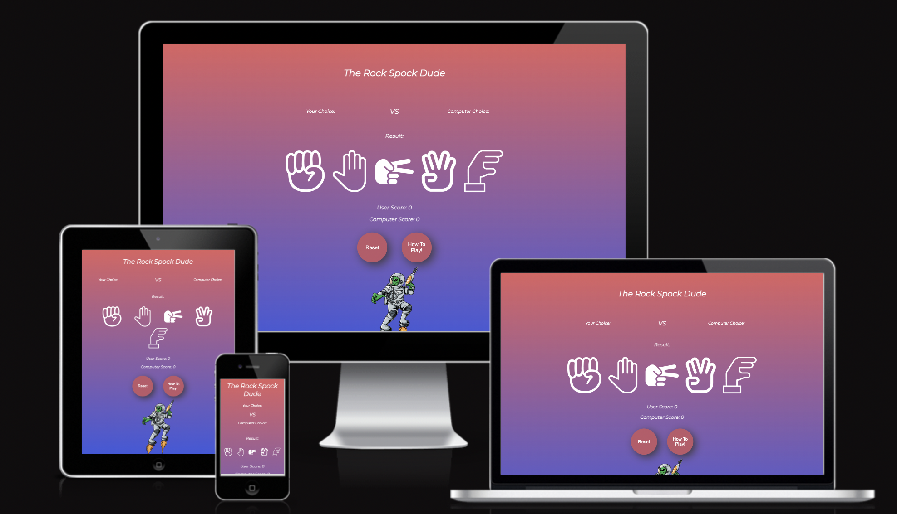

## Features 
---
### Existing Features

- __Header__

  - You are invited with a wonderful feeling.
Pink has many positive associations. It is a calming, non-threatening color. It is linked to innocence, hope and optimism.

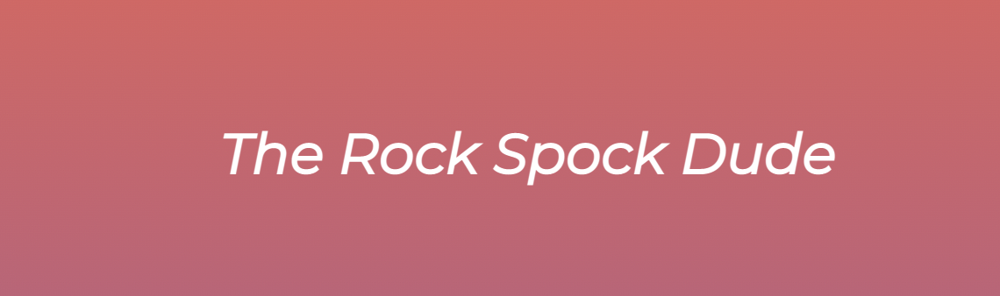

---

- __Game Area__

  - On the left of the game area, you can see your own choice. The computer's choice is shown on the right.
  

  - It is clear which choice you made and which one the computer made. The results section shows if you won, lost, or drew.

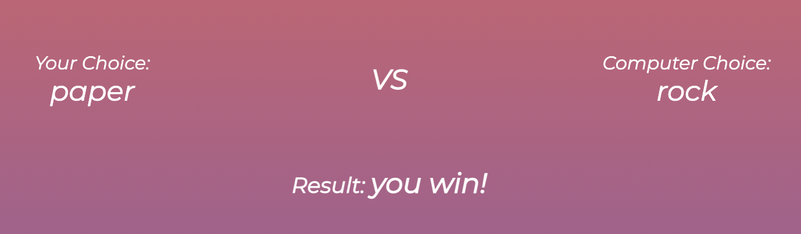
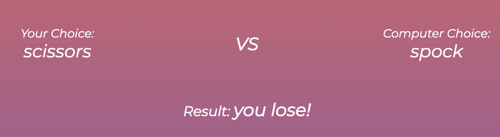

---

- __Game Buttons__

  - As a result of its structure with JavaScript, the computer randomly selects a number from 1 to 5, so the outcome is determined by chance.
  - Your choices can be found by clicking the buttons.
  - The following are from left to right: Rock, Paper, Scissors, Spock, Lizard.
  - User and the computer's points are visible below the buttons, this allows the user to quickly see how many points they have.
  - First to get to 5 wins.

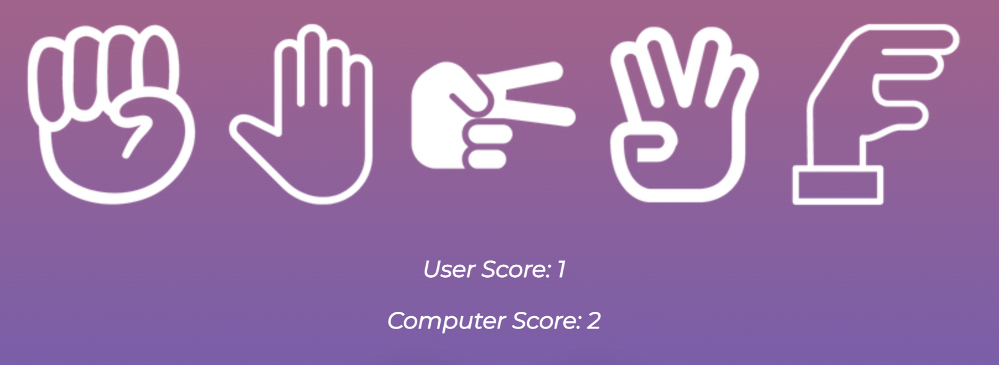

---
- __Winning/losing__

  - When you win, you can either press "OK", otherwise anywhere on the page.
The game restarts automatically and resets previous choices and results.
This makes the user experience better.
  - If you win, an alert will be sent out stating that you are "The Rock Spock Dude!"
  

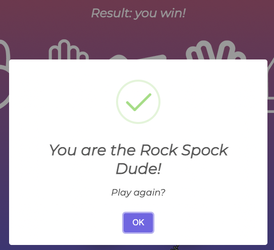

- If you lose, an alert will be sent out stating that you are "Trash!"
- It even has a link to the main page that says, "Why am I trash?"
- A little extra sourness is added when you lose this way!

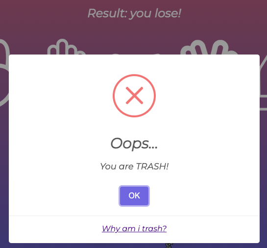

---

- __Reset and How To Play__ 

  - Two buttons, easily accessible and "stand out" from the background with shading.
  - Press reset to reset the current result and previous choice.
  - How to play opens an easy-to-read information about the game as well as rules.

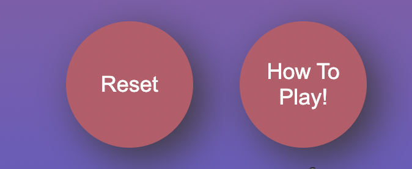

---

- __How To Play__

  - A shaded popup with information about the game and rules. You close the box by either pressing X or anywhere on the page.
  - Emojis to give the user a clearer overview.

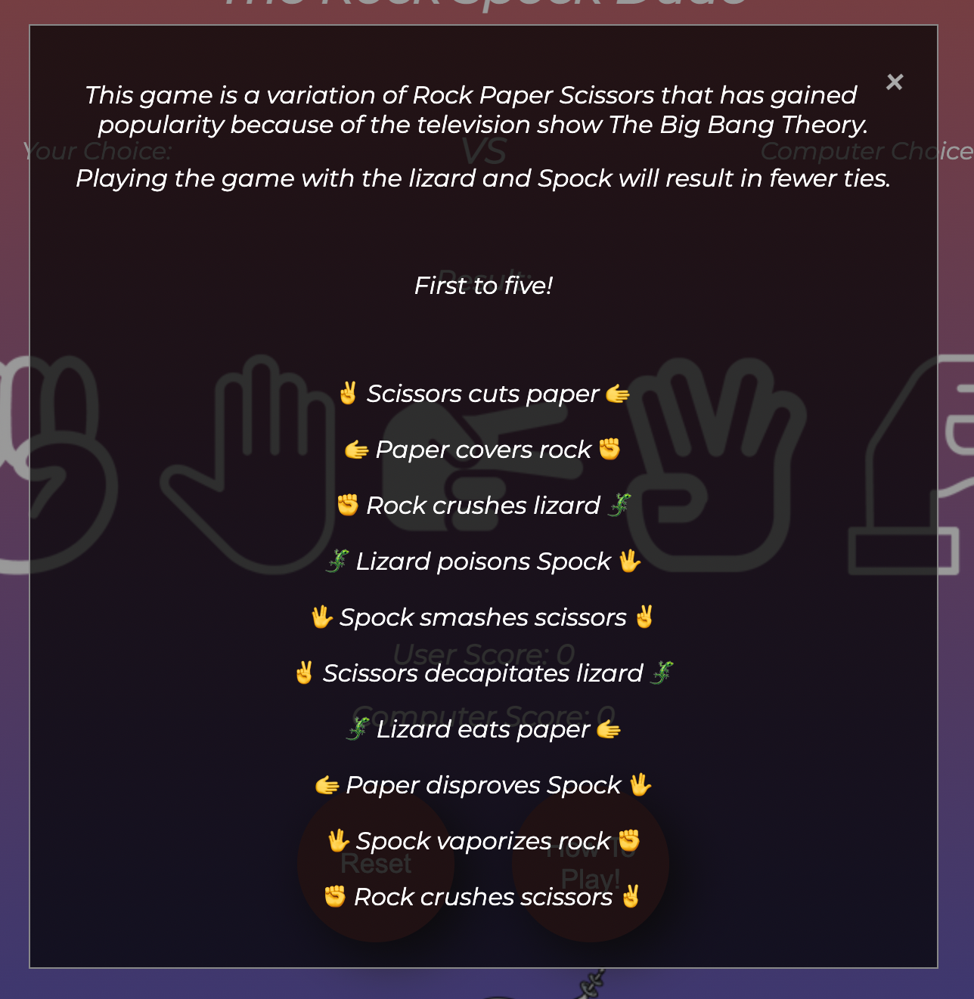

---

- __The Spock Dude__

  - The spock dude.

---

## Testing 

I have tested the page in different browsers: Chrome, Safari, Microsoft Edge.

The entire project is tested with devtools device toolbar and everything works responsively, looks good and arranges itself depending on the size of the screen.

### Validator Testing 

- HTML
  - No errors were returned when passing through the official [W3C validator](https://validator.w3.org/nu/?doc=https%3A%2F%2Fniclastanskanen.github.io%2FProject2%2F)
- CSS
  - No errors were found when passing through the official [(Jigsaw) validator](https://jigsaw.w3.org/css-validator/validator?uri=https%3A%2F%2Fniclastanskanen.github.io%2FProject2%2F&profile=css3svg&usermedium=all&warning=1&vextwarning=&lang=en)

- JavaScript
  - No error found, only 23 warnings about ES6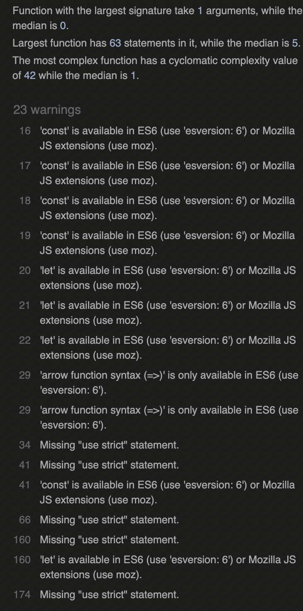

- Lighthouse
  - 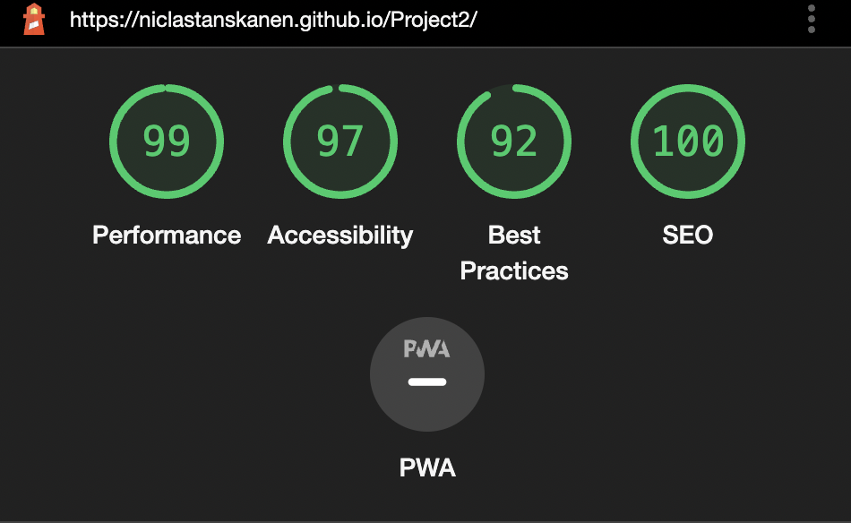

---
### Unfixed Bugs

JavaScript fails to load properly due to a bug in the chrome extension. I am unable to figure out where it is coming from. I haven't been able to get a clear answer from anyone I've spoken with either. Seems to be local to me, I get no warnings in incognito mode.

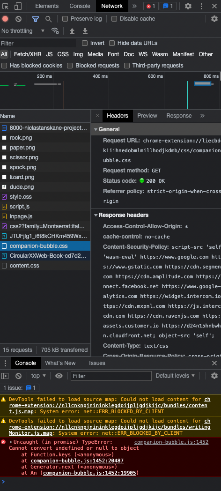

---

## Credits 

### Content 

Gradient background inspiration - https://mycolor.space/

Rules for the game - https://www.had2know.org/

"How to play" popup modal - https://www.w3schools.com/

Smart Alert warning (winner/loser pop up) - https://sweetalert2.github.io/ 

### Media

- The images are taken from canva and edited by myself. - https://www.canva.com/

## ACKNOWLEDGEMENTS

---
Mentor Jubril Akolade from Code Institute.
Can't express in words how grateful I am for him helping me with the Chrome extension bug. After troubleshooting by myself for 9 hours, Jubril jumped in and debugged with me for over 1 hour before we (Jubril) came to the conclusion that there was nothing wrong with the code, it was Chrome. 

## Thank you Jubril! 
